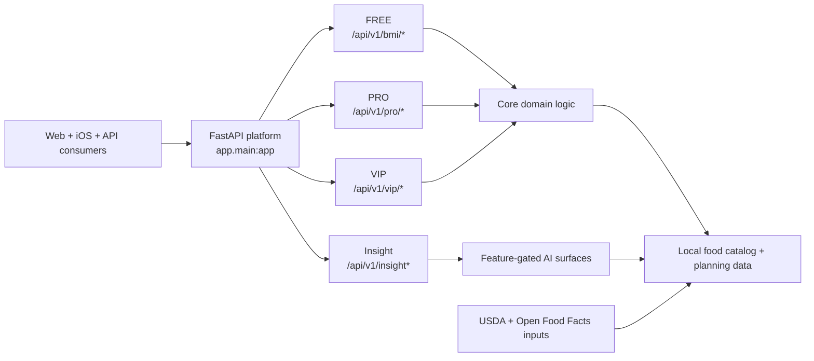

# PulsePlate

[](https://github.com/Katsiarynakavaleuskaya/PulsePlate/actions/workflows/ci.yml)
[](https://codecov.io/gh/Katsiarynakavaleuskaya/PulsePlate)
[](docs/architecture/FOOD_DATABASE_PLATFORM_STRATEGY_v1.md)
[](https://deepwiki.com/Katsiarynakavaleuskaya/PulsePlate)

Operational signals:
- `CI` shows the main backend/shared validation lane.
- `codecov` shows the latest published repository coverage snapshot.
- Runtime probes live at `/health`, `/ready`, and `/metrics`; see `docs/deploy/OPERATIONAL_SIGNALS.md`.
- OpenTelemetry tracing is bootstrap-gated by `OTEL_*` env vars plus `PULSE_OBS_HMAC_KEY`.
- In-process request telemetry exists for local/runtime diagnostics; centralized error reporting is still a follow-up gap.

> **PulsePlate turns body-metric check-ins into practical meal decisions.**
>
> It is a planning-first wellness product built around one continuous flow:
>
> **check-in -> targets -> daily plate -> weekly plan -> shopping list**

PulsePlate is designed as a **wellness and meal-planning product**, not as a diagnosis, treatment, therapy, crisis-support, or emergency-care system. BMI and related outputs are informational wellness tools only, and the product should not replace clinician guidance for diagnosed conditions, pregnancy, eating disorders, medically prescribed diets, or emergencies.

PulsePlate is currently in a **private staged rollout**. This repository is the clearest technical and product snapshot of the platform today.

## Developer And Contributor Entrypoint

If you are here to build, review, or deploy rather than evaluate the product story first, start here:

- `AGENTS.md` for repository-wide engineering rules and merge-governance policy
- `RUNBOOK_AGENT.md` for CI triage, merge-readiness, and post-merge cleanup flow
- `docs/dev/AGENT_COMPATIBILITY_ONBOARDING.md` for Cursor / Codex / Claude startup guidance
- `docs/deploy/README.md` for deployment navigation
- `docs/deploy/OPERATIONAL_SIGNALS.md` for runtime probes, metrics, tracing, and current gaps
- `docs/contracts/API_CANONICAL_MAP.md` for the canonical public API surface

If you need the shortest docs-only path first, you can contribute safely in Markdown without depending on the full maintainer-only backend bootstrap.

## From Metrics To Meals

Most nutrition apps stop at logging. PulsePlate is being built to keep going:

1. Start from simple body-metric and nutrition inputs.
2. Turn them into practical targets and daily plate guidance.
3. Extend that into weekly planning and grocery workflows.
4. Layer in AI-assisted support only where it adds real planning value.

The goal is straightforward: **less tracking noise, less decision fatigue, more repeatable nutrition planning**.

## Who PulsePlate Is For

PulsePlate is aimed first at people who want nutrition planning to feel more actionable:

- users who want a clearer path from simple check-ins to actual meal decisions
- people who want less decision friction around meals and groceries
- users who want planning help, not just another calorie log

### A concrete PulsePlate moment

The target PulsePlate experience is simple: a user starts with a quick body-metric check-in, gets practical targets, sees what today's plate should look like, turns that into a weekly plan, and finishes with a shopping workflow. That is the product shape PulsePlate is optimizing for.

## Why PulsePlate Stands Out

### 1. It is planning-first, not logging-first

PulsePlate is structured around execution, not just record-keeping. The product thesis is that users need help moving from inputs to action:

- `check-in -> targets -> plate -> weekly plan -> groceries`

### 2. It combines domain logic with product workflows

This repository already contains the core layers needed for a serious nutrition product:

- a backend/domain core for BMI and nutrition logic
- planning surfaces for daily and weekly decision-making
- shopping/export flows
- thin web and iOS client layers
- a food-data foundation that can support richer planning over time

### 3. It uses a snapshot-first food-data model

Instead of relying on live third-party lookups for every request, PulsePlate is built around a local merged catalog strategy. That supports lower latency, more stable lookups, and future enrichment on top of a controlled data foundation.

### 4. Its AI direction is staged, not decorative

PulsePlate has a real AI research and product direction, but it is being rolled out carefully. Current and planned work explores:

- retrieval-augmented support
- consistency and contradiction checks
- optional planning assistance
- progressively stronger planning assistance

Not all of these capabilities are user-facing, enabled by default, or fully deployed in production today.

## What Exists Today

| Layer | Current reality |
|---|---|
| FREE | BMI-based wellness check-ins and basic lookup surfaces |
| PRO | Nutrition targets, daily nutrition guidance, planning and payment flows |
| VIP | Higher-end planning, menu flows, recipes, export/shopping-list surfaces |
| Data foundation | Local merged food catalog built from USDA and Open Food Facts inputs |
| Clients | Active web and iOS codebases over a FastAPI backend |

### Live and staged surfaces

- **Live core:** backend API, domain logic, food-data pipeline, PRO/VIP planning surfaces
- **Selective rollout:** release packaging, monetization closure, and deploy/runtime polish
- **Feature-gated exceptions:** `/api/v1/insight*` and `/api/v1/insight/fitchef*`

## Where The Product Stands

PulsePlate is already **substantial at the backend/domain level**. Today the strongest parts are the planning core and the data foundation; advanced assistance and release packaging are being rolled out selectively around that base.

At a high level, treat PulsePlate as an **active product platform in staged rollout**: the planning foundation is real today, while some packaging, monetization, and advanced assistance layers are still being tightened.

| Area | Status |
|---|---|
| Backend API and domain core | Active and substantially implemented |
| Food-data pipeline | Active and substantially implemented |
| Web app | Active |
| iOS app | Active |
| Monetization and entitlement closure | Selective rollout / hardening |
| Release packaging and deployment polish | Selective rollout / hardening |
| Advanced assistance surfaces | Partial / feature-gated |

## For Contributors And Integrators

If you are reading this README primarily as a product visitor, the sections above are the main story. Everything below is contributor and integration context.

If you are here primarily as a contributor, reviewer, or integration partner, use the paths below.

### Fastest first-success path

Most new contributors should start here first.

If you do not already have access to the approved Python package proxy, treat the backend bootstrap as maintainer-only for now and use this newcomer path:

- docs-only contributions
- frontend work in `frontend/`
- iOS exploration in `ios/`

That path gets you to a first successful contribution without depending on the full backend bootstrap.

Move to the maintainer setup below only when you explicitly need backend access and the approved proxy path.

## Maintainer Setup

### Prerequisites

- Python `3.13.x`
- Node `22.22.1` for the web client
- Xcode for the iOS project in `ios/PulsePlate.xcodeproj`
- Access to the approved Python package proxy for full backend bootstrap

If you do **not** have access to the approved package proxy, stop here and use the first-success path above. Full backend bootstrap is currently maintainer-oriented.

If you need full backend access, coordinate with the maintainer before attempting backend/bootstrap work.

### 1. Backend

Bootstrap environment values first:

```bash
cp .env.example .env
```

For local contributor setup, make sure `.env` contains at least:

- `PULSEPLATE_PYTHON_INDEX_URL` for `make`-driven bootstrap targets
- `SERVER_SALT` for app startup validation; replace the `.env.example` placeholder with a strong local value before boot

Important:

- the copied `.env.example` default `DATABASE_URL=...@postgres:5432/...` is compose-network only
- it does **not** work unchanged for a host-native `alembic upgrade head` or `make dev` flow on your laptop

Before running `alembic upgrade head`, choose the right database host for your local path:

- Docker Compose / shared container path: keep `postgres` in `DATABASE_URL`
- Native local Postgres path: switch `DATABASE_URL` to `localhost`
- Local-only SQLite fallback: use the commented SQLite example for dev/test-only work
- Hybrid path warning: this repo does not publish the compose Postgres port to the host by default, so "Postgres in Compose + app on the Mac" is not a ready-made path unless you add your own port mapping or run a separate local Postgres

Additional secrets are only required for specific features or production-like environments:

- `APPLE_SHARED_SECRET` for Apple receipt verification in production/staging-like setups
- `EXPORT_TOKEN_SECRET` when `PRIVATE_EXPORTS_ENABLED=true` in production/staging-like setups

For local-only boot, non-empty placeholder values remain acceptable for `APPLE_SHARED_SECRET` and `EXPORT_TOKEN_SECRET` unless you are actively testing those flows.

Export the env into your current shell, then run the supported bootstrap path:

```bash
set -a && source .env && set +a
make venv
source .venv/bin/activate
alembic upgrade head
make dev
```

Verify the API from another terminal:

```bash
curl http://127.0.0.1:8001/health
```

Preferred health surface:

- use `/health` for the canonical liveness check
- `/api/v1/health` remains a compatibility alias used by some scripts/tests

Port note:

- Native local development uses `make dev` on `http://127.0.0.1:8001`
- Raw `uvicorn` is only equivalent when you also pass `--host 0.0.0.0 --port 8001`

### 2. Web app

```bash
cd frontend
nvm use
npm ci
npm run dev
```

`nvm use` reads the repo-root `.nvmrc` and selects Node `22.22.1`.

### 3. iOS app

Open `ios/PulsePlate.xcodeproj` in Xcode and run the `PulsePlate` scheme on a simulator.

### 4. Docker

Docker build also expects the approved Python package proxy and runtime env values that satisfy startup guards:

```bash
set -a && source .env && set +a
make docker-build
docker compose up -d
curl http://localhost:8000/health
```

Docker port note:

- The container listens on `8000`
- If you use `docker compose`, verify the published host port from `docker-compose.yaml` before reusing the native-local `8001` curl example

Quick mode matrix:

| Mode | Host port | Preferred health URL |
| --- | --- | --- |
| Native `make dev` | `8001` | `http://127.0.0.1:8001/health` |
| Raw `uvicorn ... --port 8001` | `8001` | `http://127.0.0.1:8001/health` |
| Default `docker compose up` | `8000` | `http://127.0.0.1:8000/health` |
| `docker compose --profile dev up` | _see compose mapping_ | verify the published host port in `docker-compose.yaml` before curling |

## Architecture At A Glance



### Working rule of thumb

- `app/` orchestrates HTTP/runtime behavior
- `core/` owns domain logic
- clients stay thin over backend truth
- backend OpenAPI is the contract baseline

## Product Tiers

| Tier | Purpose | Typical surface |
|---|---|---|
| **FREE** | Entry point into the product | BMI-based check-ins, lookup, simple planning inputs |
| **PRO** | Core planning value | Targets, daily nutrition, weekly planning, payment activation |
| **VIP** | Advanced planning and AI-assisted surfaces | Weekly menu flows, recipes, shop/export, insight and FitChef lanes |

## Canonical Product Surfaces

For new backend or client work, the main canonical route families are:

- `/api/v1/bmi/*`
- `/api/v1/pro/*`
- `/api/v1/vip/*`

Important canonical exceptions also exist:

- `/api/v1/insight*`
- `/api/v1/insight/fitchef*`
- `/api/v1/billing/apple/verify-receipt`

Legacy `/api/v1/premium/*` routes remain compatibility surfaces only and should not be treated as the canonical namespace for new client work.

## Repository Layout

```text
PulsePlate/
├── app/            # FastAPI app layer: routers, middleware, schemas, services
├── core/           # Domain engines and shared business logic
├── frontend/       # React + TypeScript + Vite web client
├── ios/            # SwiftUI iOS client
├── providers/      # LLM/provider integrations
├── data/           # Local food snapshots, merge outputs, recipe templates
├── docs/           # Contracts, specs, runbooks, roadmap, architecture
├── tests/          # Backend, client, and policy guard tests
├── scripts/        # CI, ops, orchestration, and utility scripts
└── alembic/        # Database migrations
```

## Data Foundation

PulsePlate's food-data layer is built around reviewed local snapshots and merge workflows rather than a live-request dependency for every lookup.

- Sources include **USDA FoodData Central** and **Open Food Facts**
- Merge outputs live in `data/`
- Architecture direction: `docs/architecture/FOOD_DATABASE_PLATFORM_STRATEGY_v1.md`
- Source-policy boundaries: `docs/legal/EXTERNAL_FOOD_SOURCE_OPERATING_POLICY.md`

Food data can be incomplete or vary by market, manufacturer, and packaging updates. Critical nutrition information should always be verified against official labels or source records.

## Go Deeper

- `docs/architecture/system_overview.md` - system-level product and runtime map
- `docs/contracts/API_CANONICAL_MAP.md` - canonical route map and namespace rules
- `docs/contracts/PRODUCT_TIER_MAP.md` - FREE / PRO / VIP semantics
- `docs/deploy/README.md` - deployment and infrastructure guidance
- `docs/runbooks/ENGINEER_QUICKPATH.md` - operator quick path

## Interested In PulsePlate?

For demo, collaboration, integration, or licensing conversations:

- email: [pulseplate@pm.me](mailto:pulseplate@pm.me)
- topic examples: product demo, API/integration discussion, partnership, private rollout access

## Contributing

Before changing code:

1. Required reading:
   - `AGENTS.md`
   - `docs/ENGINEERING_LESSONS.md`
   - `RUNBOOK_AGENT.md`
   - the nearest scoped `AGENTS.md` for the files you touch
2. Use the checks that match your surface:

- docs / copy changes: follow the relevant docs guidance and keep the PR docs-only
- frontend-only changes: run the frontend-local checks for `frontend/`
- iOS-only changes: run the iOS-local checks for `ios/`
- backend local iteration (maintainer/proxy-approved path):
  - `make validate-min` for the cheap deterministic guard + smoke bundle
  - `make validate-changed` for diff-based Python test selection on your current branch
  - targeted `pytest` when narrowing a specific backend change
- maintainer full-stack/backend changes: run:

```bash
pre-commit run --all-files
make verify
```

Public deployments should also ship with clear privacy and data-use notices for health-related inputs and any third-party services involved in processing them.

## License

This project is **proprietary software**. All rights reserved.

Unauthorized copying, distribution, modification, or use of this code is prohibited without prior written permission from the author.

For commercial or licensing inquiries: [pulseplate@pm.me](mailto:pulseplate@pm.me)
