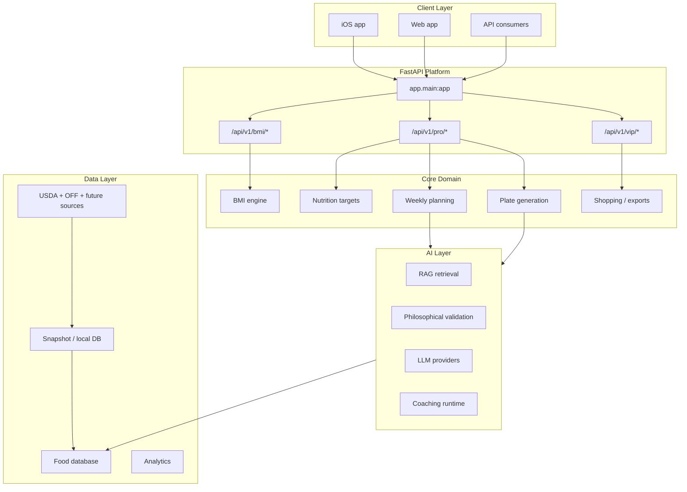

# PulsePlate

[](https://github.com/Katsiarynakavaleuskaya/PulsePlate/actions/workflows/ci.yml)
[](https://github.com/Katsiarynakavaleuskaya/PulsePlate/actions/workflows/coverage.yml)
[](https://codecov.io/gh/Katsiarynakavaleuskaya/PulsePlate)
[](DATA_SOURCES.md)

> **PulsePlate** is a nutrition and meal-planning platform for web, iOS, and API integrations.  
> It connects BMI screening, nutrition targets, daily plate guidance, weekly planning, shopping lists, and AI-assisted nutrition workflows into one product flow.

**Positioning:** PulsePlate is built as a **wellness and nutrition product**.  
It is not presented in this repository as a diagnosis, treatment, or emergency-care system.

---

## What PulsePlate does

PulsePlate is designed to help users move from **raw health metrics** to **practical daily decisions**.

### Current product capabilities

- BMI and risk-oriented screening
- WHO-based nutrition targets
- Daily nutrition and plate guidance
- Weekly meal planning
- Shopping list generation and export
- Food lookup powered by USDA FoodData Central and Open Food Facts
- Web and iOS clients over a FastAPI backend
- PRO and VIP gated product surfaces for advanced planning features

### In active hardening / staged rollout

- Monetization runtime and entitlement closure
- Release-readiness shell for web and iOS
- Advanced AI-assisted planning and coaching surfaces
- Deeper food-data and retrieval-quality expansion

---

## Why PulsePlate is different

### 1. It connects planning, not just logging

Many nutrition apps stop at calorie counting. PulsePlate is structured around a broader flow:

**screening -> targets -> daily plate -> weekly plan -> shopping list**

That makes the product more operational and more useful in real daily life.

### 2. It combines nutrition logic with real product workflows

PulsePlate is not only a calculator. It already includes the main layers needed for a practical nutrition product:

- nutrition engine
- meal-planning engine
- shopping pipeline
- food database layer
- thin web and iOS client surfaces

### 3. It uses a snapshot-first food-data architecture

Instead of depending on live third-party requests for every lookup, PulsePlate is designed around a local merged catalog strategy. This reduces latency, improves stability, and makes future enrichment possible.

### 4. Its AI roadmap is grounded, not decorative

The long-term AI direction is informed by:

- Bayesian personalization
- recursive RAG
- philosophical logic validation
- CBT-aligned coaching

These layers are part of the project’s real architecture and research direction, but they are being productized progressively rather than marketed as fully finished everywhere.

---

## Current status

| Area | Status |
|---|---|
| Backend API | Strong and active |
| Web app | Active |
| iOS app | Active |
| Core nutrition engine | Strong |
| Food-data pipeline | Strong |
| Release shell | Under active hardening |
| Monetization closure | Under active hardening |
| Advanced AI runtime wiring | Partial / staged |

### Honest project state

PulsePlate is **architecturally strong**, but the repository is still in an **active release-hardening phase**.

That means:

- the product core is already meaningful and non-trivial
- backend and data layers are ahead of the public packaging layer
- deploy, entitlement truth, release policy, and some client-runtime surfaces are still being tightened

If you are reading this as a developer, contributor, or reviewer, the most important current theme is not “more scope”, but **closing the runtime and release shell cleanly**.

---

## Product tiers

| Tier | Purpose | Typical surface |
|---|---|---|
| **FREE** | Entry point into the product | BMI, food/recipe lookup, basic screening |
| **PRO** | Core planning value | Nutrition targets, daily nutrition, weekly planning, shopping workflows |
| **VIP** | Advanced planning and AI-assisted flows | Higher-end planning, optimization, selected AI surfaces |

### Canonical API namespaces

For new work, treat these as the product source of truth:

- `/api/v1/bmi/*`
- `/api/v1/pro/*`
- `/api/v1/vip/*`

Legacy `/api/v1/premium/*` routes remain compatibility surfaces and should not be treated as the canonical namespace for new client work.

---

## System overview



---

## Repository layout

```text
PulsePlate/
├── app/            # FastAPI app layer: routers, middleware, schemas, services
├── core/           # Domain engines and shared business logic
├── frontend/       # React + TypeScript + Vite web client
├── ios/            # SwiftUI iOS client
├── providers/      # LLM/provider integrations
├── docs/           # Specs, runbooks, contracts, roadmaps, reports
├── tests/          # Backend and policy guard tests
├── scripts/        # CI, ops, orchestration, and utility scripts
└── alembic/        # Database migrations
```

### Architectural rule of thumb

- `app/` orchestrates
- `core/` owns business logic
- clients should stay thin over backend truth
- backend OpenAPI is the canonical contract source

---

## Quick start

### 1. Backend

```bash
python -m venv .venv
source .venv/bin/activate
python -m pip install -U pip setuptools wheel
pip install -r requirements-dev.txt
pip install -r requirements.txt
alembic upgrade head
uvicorn app.main:app --reload
```

Verify the API:

```bash
curl http://127.0.0.1:8000/health
```

### 2. Web app

```bash
cd frontend
npm install
npm run dev
```

### 3. iOS app

Open the project in Xcode from the `ios/` directory and run the **PulsePlate** scheme on a simulator.

### 4. Docker

```bash
make docker-build
docker run -p 8000:8000 pulseplate:latest
curl http://localhost:8000/health
```

---

## Documentation map

Key entry points:

- [`docs/policy/`](docs/policy/) — invariants and engineering rules
- [`docs/runbooks/`](docs/runbooks/) — CI, debugging, and ops playbooks
- [`docs/deploy/`](docs/deploy/) — deployment and infrastructure
- [`docs/specs/`](docs/specs/) — contracts and API-facing specifications
- [`docs/roadmap/`](docs/roadmap/) — roadmap, backlog, and execution planning
- [`docs/reports/`](docs/reports/) — status and audit artifacts

---

## Current roadmap focus

Current priority is **release closure**, not architecture expansion.

### Current critical path

- monetization runtime and entitlement truth
- canonical API parity across clients
- web and iOS release-readiness hardening
- Postgres-first deploy hardening
- legal / compliance publication surfaces
- AI/runtime follow-through only after release blockers are stable

### What is intentionally not the immediate priority

- broad new AI scope
- speculative feature expansion
- GTM/brand work that hides runtime gaps instead of solving them

---

## Contributing and repo governance

Before making changes:

1. Read `AGENTS.md`
2. Read the nearest scoped `AGENTS.md` for the files you touch
3. Run:

```bash
pre-commit run --all-files
make verify
```

Important repo rule: **green CI alone is not merge readiness**.  
Review-thread resolution, fixed-in-commit mapping, and current-head checks remain part of the merge contract.

---

## Project direction

PulsePlate is being built as a serious nutrition platform with:

- a strong backend/domain core
- staged productization on web and iOS
- a practical food-data foundation
- a disciplined execution model
- a long-term AI moat that is being rolled out carefully

The core thesis is simple:

> move from fragmented tracking tools to a single system that helps users understand their metrics, set targets, plan meals, and act on them.

---

## License

This project is **proprietary software**. All rights reserved.

Unauthorized copying, distribution, modification, or use of this code is prohibited without prior written permission from the author.

For commercial or licensing inquiries: **lexakm532@gmail.com**
