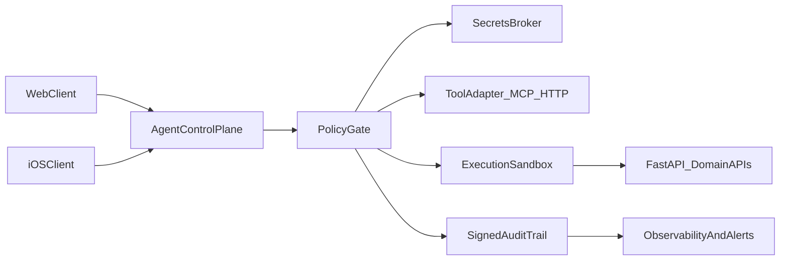

# ADR-003: Agent Control Plane MVP

- Status: Accepted
- Date: 2026-02-20
- Owners: Architecture + Backend + Security

## Context

PulsePlate needs agent automation without trusting a third-party local agent runtime that stores long-lived secrets and persistent memory on developer machines. We need a secure, vendor-independent pattern that keeps current FastAPI contracts as the domain source of truth.

## Decision

Implement a two-plane model:

1. Control Plane (policy and orchestration)
2. Execution Plane (existing FastAPI domain APIs and approved tool adapters)

The Control Plane is introduced first as an MVP with strict policy gates.

## Architecture

## MVP Requirements (Wave 1)

- Deny-by-default action policy
- Explicit allowlist for tools and outbound targets
- Signed audit envelopes for every privileged action
- Short-lived credentials only (no plaintext local secret persistence)
- Fail-closed behavior when policy/secrets are unavailable

## Evidence and intent markers (`file:line`)

- Existing enforcement baseline:
  - `AGENTS.md:8` — canonical hard gate requires `make verify`.
  - `RUNBOOK_AGENT.md:121` — Security Ops checklist for containment/rotation/verification.
  - `docs/orchestration/workflow.md:97` — governance checkpoint for agent automation work.
  - `docs/security/AGENT_CONTROL_PLANE_SECURITY_BASELINE.md:9` — mandatory controls contract.
- Intent-only architecture seams in this ADR (to be implemented in follow-up PRs):
  - `PolicyGate`, `SecretsBroker`, `ExecutionSandbox`, `SignedAuditTrail` in the diagram are MVP target components, not already-landed runtime modules in this PR.
  - Tracking item and owner/DoD: `docs/roadmap/BACKLOG_LEDGER.md:60` (`P0: Agent Control Plane MVP`).
  - Exit criteria: convert each seam from intent to implementation with code-level anchors in `app/`/`core/` and deterministic tests; then update this ADR evidence block with concrete `file:line` pointers.

## Security Boundaries

- `SecretsBroker`: single authority for credential vending
- `PolicyGate`: required before tool execution
- `ExecutionSandbox`: bounded execution for higher-risk actions
- `SignedAuditTrail`: tamper-evident execution trace

## Non-Goals (MVP)

- Full autonomous no-human production mode for high-risk actions
- Broad unrestricted local computer automation
- Replacing current backend domain contracts

## Consequences

Positive:

- Restores trust boundaries after local-agent compromise risk
- Keeps backend as contract source of truth
- Enables future provider swaps without architecture rewrite

Trade-offs:

- Initial implementation overhead in policy and audit layers
- Slightly slower iteration for privileged actions

## Rollout

- Wave 1 (0-30d): control plane skeleton + policy + signed audit + secrets baseline
- Wave 2 (31-90d): contract governance and CI throughput integration
- Wave 3 (91-180d): RAG v2 + safety eval gates at scale

## Verification

- Policy bypass tests in `tests/` guard suite
- Audit evidence coverage for privileged actions
- `make verify` and pre-commit gates remain mandatory
