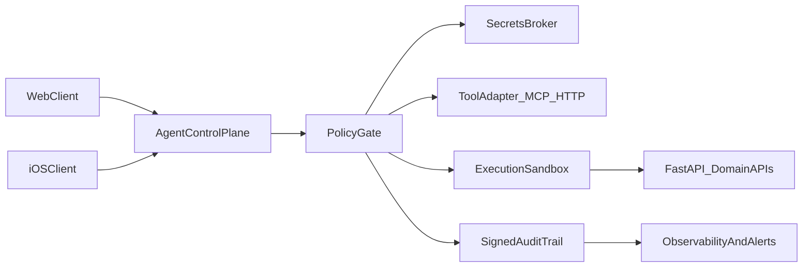

# ADR-003: Agent Control Plane MVP

- Status: Accepted
- Date: 2026-02-20
- Owners: Architecture + Backend + Security

## Context

PulsePlate needs agent automation without trusting a third-party local agent runtime that stores long-lived secrets and persistent memory on developer machines. We need a secure, vendor-independent pattern that keeps current FastAPI contracts as the domain source of truth.

## Decision

Implement a two-plane model:

1. Control Plane (policy and orchestration)
2. Execution Plane (existing FastAPI domain APIs and approved tool adapters)

The Control Plane is introduced first as an MVP with strict policy gates.

## Architecture

## MVP Requirements (Wave 1)

- Deny-by-default action policy
- Explicit allowlist for tools and outbound targets
- Signed audit envelopes for every privileged action
- Short-lived credentials only (no plaintext local secret persistence)
- Fail-closed behavior when policy/secrets are unavailable

## Evidence and intent markers (`file:line`)

- Existing enforcement baseline:
  - `AGENTS.md:8` — canonical hard gate requires `make verify`.
  - `RUNBOOK_AGENT.md:121` — Security Ops checklist for containment/rotation/verification.
  - `docs/orchestration/workflow.md:97` — governance checkpoint for agent automation work.
  - `docs/security/AGENT_CONTROL_PLANE_SECURITY_BASELINE.md:9` — mandatory controls contract.
- Runtime primitives landed for Wave 1 (first implementation slice):
  - `app/security/agent_control_plane.py:1` — `PolicyGate` (deny-by-default), `SignedAuditEnvelope`,
    and `IssuedScopedToken` helpers with fail-closed secret requirements.
  - `tests/test_agent_control_plane_mvp.py:1` — deterministic validation of policy decisions,
    audit signature integrity, and scoped-token TTL/secret validation.
- Runtime integration slice landed for privileged CBT/RAG work:
  - `app/routers/cbt_insight.py:218` — execution mode resolved fail-closed before privileged work.
  - `app/routers/cbt_insight.py:261` — policy gate + signed audit persisted before `rag.retrieve`.
  - `app/routers/cbt_insight.py:340` — policy gate + signed audit persisted before `llm.generate`.
  - `app/routers/cbt_insight.py:352` — PRO monthly quota enforced before provider call.
  - `core/rag/simple_rag.py:109` — chunk content redacted before preview/prompt exposure.
  - `tests/test_cbt_insight_api.py:680` — deterministic blocked/misconfigured mode coverage.
  - `tests/test_cbt_insight_api.py:710` — deterministic PRO quota enforcement coverage.
- Local sandbox foundation landed for developer-machine orchestration work:
  - `app/security/execution_sandbox.py:1` — bounded local execution sandbox with
    allowlisted binaries, cwd confinement, timeout, output, and env controls.
  - `scripts/orchestration/run_local_sandbox.py:1` — deterministic CLI wrapper for
    exercising the sandbox locally.
  - `tests/test_execution_sandbox.py:1` — deterministic validation of allowed,
    denied, timeout, truncation, and cwd-escape paths.
- Tracking items and status live in `docs/roadmap/BACKLOG_LEDGER.md` (`Agent Control Plane MVP`,
  local execution sandbox foundation, `simple_rag` thread safety, PRO quota parity,
  and RAG redaction follow-ups).
- Remaining scope for follow-up PRs is intentionally narrow:
  - Stronger isolation beyond the developer-machine sandbox (for example, container/VM runner boundary).
  - Nonce-bearing scoped tokens and wider production rollout hardening.
  - Expand control-plane wiring beyond the current privileged CBT/RAG slice when new agent runtimes land.

### Exit Criteria (Updated Status)

This ADR introduced a temporary seam for MVP primitives. For the current privileged
CBT/RAG execution slice, the operational closure criteria are now met:

1. **Policy gate integrated**: all privileged agent actions pass through `require_policy_allow()`.
2. **Audit trail persistent**: signed envelopes are written to durable storage (not just in-memory).
3. **Secrets boundary enforced**: fail-closed secret requirements remain in place.
4. **Execution modes enforced**: `auto-safe`, `review-required`, and `blocked` are resolved fail-closed.
5. **Quota + redaction enforced**: quota is consumed before provider calls; RAG previews/context are redacted.
6. **Bounded local sandbox available**: higher-risk developer-machine execution now runs only through
   the allowlisted sandbox boundary with explicit cwd/env/output limits.
7. **Test coverage**: deterministic tests verify bypass, timeout, quota, mode, and sandbox failure paths.

The broader `ExecutionSandbox` box in the architecture diagram remains a future
stronger-isolation expansion boundary, but it is no longer a blocker for the
current control-plane MVP slice.

Open follow-up work is now narrower:

- remote/stronger isolation beyond the developer-machine sandbox
- nonce-bearing scoped tokens
- broader multi-surface rollout beyond the current CBT/runtime slice

## Security Boundaries

- `SecretsBroker`: single authority for credential vending
- `PolicyGate`: required before tool execution
- `ExecutionSandbox`: bounded local execution for higher-risk actions
- `SignedAuditTrail`: tamper-evident execution trace

## Non-Goals (MVP)

- Full autonomous no-human production mode for high-risk actions
- Broad unrestricted local computer automation
- Replacing current backend domain contracts

## Consequences

Positive:

- Restores trust boundaries after local-agent compromise risk
- Keeps backend as contract source of truth
- Enables future provider swaps without architecture rewrite

Trade-offs:

- Initial implementation overhead in policy and audit layers
- Slightly slower iteration for privileged actions

## Rollout

- Wave 1 (0-30d): control plane skeleton + policy + signed audit + secrets baseline
- Wave 2 (31-90d): contract governance and CI throughput integration
- Wave 3 (91-180d): RAG v2 + safety eval gates at scale

## Verification

- Policy bypass tests in `tests/` guard suite
- Audit evidence coverage for privileged actions
- `make verify` and pre-commit gates remain mandatory
