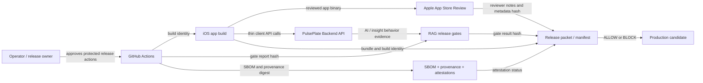

# C4 Release Control Plane Context

**Status:** PR-0 governance context
**Date:** 2026-04-29
**Packet:** [`docs/orchestration/RELEASE_CONTROL_PLANE_TASK_PACKET_2026-04-29.md`](../orchestration/RELEASE_CONTROL_PLANE_TASK_PACKET_2026-04-29.md)
**Epic:** [`docs/release/RELEASE_CONTROL_PLANE_EPIC.md`](../release/RELEASE_CONTROL_PLANE_EPIC.md)

## Purpose

This context shows the release-facing control plane that will connect App Store
Review evidence, RAG/ML gates, supply-chain provenance, and final release
decisioning. It is intentionally C4 System Context level. It does not replace
runtime architecture docs, App Store readiness work, or CI workflow contracts.

## Context Diagram

## Review-Risk Map

| Edge | Risk | Control-plane evidence |
| --- | --- | --- |
| Operator -> CI | Protected action bypass | Protected environment evidence stays operator-owned |
| CI -> iOS app build | Build identity drift | `git_sha`, build number, bundle ID |
| iOS app build -> App Store Review | Reviewer cannot reproduce claims | reviewer notes hash and metadata hash |
| iOS app -> Backend API | Runtime/API mismatch | existing OpenAPI and backend smoke gates in later slices |
| Backend API -> RAG gates | AI behavior not evaluated | RAG gate result hash and eval artifact hash |
| CI -> Supply-chain evidence | Artifact provenance missing | SBOM digest, provenance digest, attestation status |
| Manifest -> Production candidate | Reviewed build differs from production candidate | review/prod equivalence check in PR-4 |

## Existing Source Of Truth

- System overview: `docs/architecture/system_overview.md`
- AI bounded context: `docs/architecture/C4_AI_BOUNDED_CONTEXT_PACKET_2026-03-20.md`
- RAG gates: `docs/evals/PULSEPLATE_RAG_RELEASE_GATES.md`
- RAG runner: `scripts/evals/run_rag_release_gates.py`
- Docker provenance verifier: `scripts/ci/check_docker_provenance_attestation.py`
- App Store rollout runbook: `docs/runbooks/IOS_APPSTORE_ASSETS_ROLLOUT.md`
- App Store metadata and reviewer notes: `ios/fastlane/metadata/`

## Non-Goals

- No runtime behavior changes in PR-0.
- No App Store metadata or Fastlane edits in PR-0.
- No RAG runner changes in PR-0.
- No GitHub Actions workflow edits in PR-0.
- No source-of-truth transfer to Figma, Canva, Hugging Face, Netlify, or Cloudflare.

## Maintenance Rule

When a later release-control-plane slice adds a real validator or manifest
generator, update this context only if the edge list or decision ownership
changes. Do not duplicate implementation details that belong in future slice
packets or tests.
