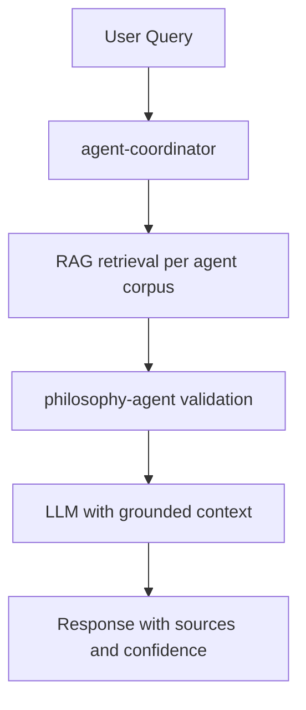

# RAG Implementation & Agent Knowledge Audit

> **Файл:** `docs/audit/RAG_IMPLEMENTATION_AND_AGENT_KNOWLEDGE_AUDIT.md`
> **Ветка:** `docs/audit-rag-implementation-and-agent-knowledge`
> **Дата:** 27 февраля 2026 года (America/New_York)
> **Scope:** docs-only (без изменений в коде приложения)
> **Статус:** Draft — ожидает подтверждения команды

---

## 1. Executive Summary (RU / EN)

### RU

Текущая реализация RAG охватывает **только один эндпоинт** (`/api/v1/insight`, VIP-only) и использует детерминистический Jaccard-скоринг без векторных эмбеддингов. Ни один из доменных агентов (CBT, nutritionist, logic, philosophy, bayesian-uq и др.) не имеет прямого доступа к контексту через RAG. Персистентное хранилище для feedback отсутствует, поэтому recursive learning и адаптивная персонализация (зафиксированные в `BACKLOG_LEDGER.md`) пока не реализуемы.

**Рекомендация:** Принять этот аудит как базовую линию → выделить отдельные PR на (1) контракт RAG, (2) feedback storage, (3) поэтапное улучшение retrieval, (4) интеграцию с агентами — без смешивания runtime-изменений в этой ветке.

### EN

The current RAG implementation covers **only one endpoint** (`/api/v1/insight`, VIP-only) and uses deterministic Jaccard scoring without vector embeddings. None of the domain agents (CBT, nutritionist, logic, philosophy, bayesian-uq, etc.) have RAG-backed context access. There is no persistent feedback storage, making recursive learning and adaptive personalization (recorded in `BACKLOG_LEDGER.md`) currently unrealisable.

**Recommendation:** Accept this audit as a baseline → issue separate PRs for (1) RAG contract, (2) feedback storage, (3) incremental retrieval improvements, (4) agent integration — no runtime changes in this branch.

---

## 2. Текущая имплементация RAG (с evidence)

### 2.1 Карта файлов и строк

| Компонент | Файл | Строки | Описание |
|-----------|------|--------|----------|
| Индексация | `core/rag/simple_rag.py` | 66–80 (`_build_index`) | Сканирует `*.md` из `ROOT` и `docs/`, чанки ≤ 800 символов по абзацам |
| Скоринг | `core/rag/simple_rag.py` | 95–106 (`_score`) | Jaccard по токенам (пересечение / объединение) |
| Retrieval | `core/rag/simple_rag.py` | 109–124 (`retrieve_context`) | Возвращает **строку** с топ-N чанками (default 3), объединёнными с заголовками `# Source: filename (score=...)` |
| Инвалидация | `core/rag/simple_rag.py` | 90–92 (`invalidate_index`) | In-memory пересборка, нет персистентности |
| Feature flag | `legacy_app.py` | 2163, 2208 | `FEATURE_RAG ∈ {1, true, on, yes}` → lazy import |
| Insight (канон) | `legacy_app.py` | 2163–2173 | `POST /api/v1/insight` — RAG-контекст редактируется и подставляется в промпт |
| Insight (legacy) | `legacy_app.py` | 2208–2217 | `POST /insight` — аналогично |
| Redact | `core/insight/safety.py` | 10–23 (`redact_rag_context_for_insight`) | Удаление строк `# Source:` из контекста перед промптом |
| VIP guard | `tests/test_insight_vip_guard_api.py` | 50–78, 80–98 | Rate limit + tier check (`test_insight_v1_requires_vip_tier`, `test_insight_legacy_requires_vip_tier`) |
| Monthly quota | `tests/test_insight_vip_monthly_quota_api.py` | 69–100 | Квотирование до вызова провайдера (`test_insight_v1_over_quota_hard_stops_before_provider_call`) |

**Evidence (file:line):**

- `core/rag/simple_rag.py:109` — `def retrieve_context(query: str, max_chunks: int = 3) -> str`
- `legacy_app.py:1174-1183` — `InsightResponse` содержит только `provider` и `insight` (нет `sources[]`, `confidence`)
- `legacy_app.py:2163-2173` — блок RAG в `insight_v1`; `legacy_app.py:2208-2217` — блок RAG в `insight`

### 2.2 Контракт данных (текущий)

Текущий публичный интерфейс:

```python
# core/rag/simple_rag.py — текущая реализация
def retrieve_context(query: str, max_chunks: int = 3) -> str  # возвращает str, не list[str]
def invalidate_index() -> None
```

Источники индекса: `ROOT/*.md` + `docs/**/*.md` (только Markdown).
Нет: JSON, YAML, БД-таблиц, пользовательских данных.

**Целевой контракт** (response schema с `sources[]`, `confidence`, внутренний `RAGContext`) — см. `docs/contracts/RAG_CONTRACT.md`.

### 2.3 Ограничения (с цитатами из docs)

| # | Ограничение | Источник |
|---|-------------|----------|
| 1 | Нет векторных эмбеддингов, только keyword/Jaccard (~30% оценки RAG) | `docs/analysis/LLM_RAG_AI_ASSISTANT_ANALYSIS.md` |
| 2 | Один проход retrieval, нет multi-hop, нет query refinement | `docs/insights/RECURSIVE_METHODS_LLM_RAG.md` |
| 3 | Нет персонального RAG под планы VIP/PRO клиентов | `legacy_app.py:2167,2212` — единственные вызовы `retrieve_context` в app; тесты: `tests/test_legacy_app_diff_coverage.py:310-313`, `tests/test_rag_simple.py:29` |
| 4 | Нет связи с доменными агентами (CBT, nutritionist, logic, philosophy) | `legacy_app.py:2167,2212` — RAG только в insight; CBT/nutritionist не импортируют `retrieve_context` |
| 5 | Нет персистентного хранилища знаний (только in-memory) | `BACKLOG_LEDGER.md` ~2912: «User feedback storage — prerequisite for recursive learning» |
| 6 | Нет контура обучения (ML/RL) | `core/` — только детерминистическая логика + LLM-провайдеры |

---

## 3. Связь с BACKLOG_LEDGER

### 3.1 AI Multi-Agent Contracts (RAG/UQ/CV + Safety) — ~1727–1743

**Что задекларировано в ledger:**
- RAG-эндпоинты tier-gated, rate-limited, с квотой.
- Response schema содержит `sources[]` и `confidence`.
- Интеграция с UQ (Uncertainty Quantification) и CV-агентом.

**Что есть в коде:**
- Tier-guard (VIP-only), rate limit, месячная квота — реализованы и покрыты тестами.
- `sources[]` в ответе — отсутствует (InsightResponse: только `provider`, `insight`; см. `legacy_app.py:1174-1183`).
- Поле `confidence` — отсутствует.
- UQ и CV-агент не подключены к RAG-пайплайну.

**Gap:** Нет контракта ответа, нет `sources[]`, нет `confidence`. Требуется отдельный PR.

### 3.2 Philosophical Logic Principles for LLM Reliability — ~2869–2895

**Что задекларировано:**
- Философская валидация как слой верификации вывода LLM.
- RAG как вход для philosophy-agent перед финальным ответом.

**Что есть в коде:**
- `philosophy-agent` существует (по карте агентов в `docs/orchestration/AGENT_CONTEXT_MAP.md`).
- Philosophy-agent не получает RAG-контекст — вызывается напрямую без retrieval.
- Нет pipeline: `query → RAG → philosophy-agent → LLM → response`.

**Gap:** Связь RAG ↔ philosophy-agent не реализована.

### 3.3 Recursive Methods for LLM/RAG/AI Assistant — ~2897–2924

**Что задекларировано:**
- Multi-hop retrieval, query refinement, verification loop.
- **Recursive learning:** самоулучшение из user feedback, адаптивная персонализация.
- Prerequisite: «User feedback storage implemented».

**Что есть в коде:**
- Один проход retrieval (`retrieve_context`).
- Multi-hop — нет.
- Query refinement — нет.
- Verification loop — нет.
- User feedback storage — нет.
- Recursive learning — нет.

**Gap:** Весь блок рекурсивных методов остаётся невыполненным. Первый шаг — feedback storage.

### 3.4 Unified Framework (UnifiedAICoach) — ~2926–2946

**Что задекларировано:**
- Интеграция Philosophy + Recursive RAG + CBT в единый коуч-пайплайн.
- Единая точка входа для агентов с RAG-контекстом.

**Что есть в коде:**
- UnifiedAICoach — отсутствует как отдельный слой.
- Нет единого оркестратора, который передаёт RAG-контекст в CBT + Philosophy.

**Gap:** Архитектурный компонент не создан. Требует предварительного выполнения п. 3.2 и 3.3.

### 3.5 Nutrition Coaching (CBT) — ~2800–2812

**Что задекларировано:**
- LLM/RAG без отдельной ML-платформы.
- Философская/математическая интеграция в нутрициологию.

**Что есть в коде:**
- CBT-агент существует.
- CBT не использует RAG (нет вызовов `retrieve_context` в CBT-модуле).
- Нет интеграции с математическими верификаторами.

**Gap:** RAG для CBT не реализован.

---

## 4. Где RAG нужно добавить (аргументированно)

### 4.1 Улучшение текущего Insight RAG

Приоритет: **Средний** (не блокирует другие фичи).

| Улучшение | Обоснование | Зависимость |
|-----------|-------------|-------------|
| Vector/semantic retrieval (pgvector) | +40–60% точности по сравнению с Jaccard | pgvector уже есть в W4 semantic food search (BACKLOG ~191–212) |
| Multi-hop retrieval | Сложные запросы требуют нескольких шагов | Requires query refinement layer |
| Reranker (cross-encoder) | Повышает релевантность топ-N | Дополнительный inference, бюджет latency |
| `sources[]` в response | Прозрачность для клиента, ledger-контракт | Изменение response schema (отдельный PR) |

### 4.2 RAG для доменных агентов

Приоритет: **Высокий** (unblocks CBT, philosophy, nutritionist персонализацию).

Каждый агент должен иметь **собственный контракт доступа к знаниям**:

| Агент | Корпус знаний | Тип RAG | Tier |
|-------|--------------|---------|------|
| `cbt-agent` | CBT-протоколы, техники, кейсы | Semantic search | PRO/VIP |
| `nutritionist-agent` | Нутрициологические гайдлайны, USDA | Semantic + structured | PRO/VIP |
| `philosophy-agent` | Философские тексты, логические паттерны | Keyword + semantic | VIP |
| `logic-agent` | Логические правила, контрпримеры | Exact + semantic | VIP |
| `bayesian-uq-agent` | Вероятностные модели, prior datasets | Structured query | VIP |
| `rag-systems-agent` | Весь корпус docs/ | Full-text + semantic | ALL |

**Pipeline (целевой):**



### 4.3 Связь с «мышлением агента»

RAG — **не замена агенту**, а вход в его pipeline:

- Агент получает `context: list[str]` (или `RAGContext`) из RAG перед вызовом LLM.
- Агент может запросить `retrieve_context(refined_query)` на промежуточном шаге (multi-hop).
- Результат RAG логируется в `sources[]` и передаётся координатору.

Референс: `docs/orchestration/AGENT_CONTEXT_MAP.md`, `docs/audit/PR_TBD_UNIVERSAL_AGENT_ORCHESTRATION_LAYER_AUDIT.md`.

---

## 5. Инструменты и сервисы

### 5.1 Что добавить

| Инструмент | Обоснование | Приоритет | Бюджет |
|------------|-------------|-----------|--------|
| **pgvector** (уже в W4) | Векторный бэкенд, нет новых зависимостей | Высокий | $0 (уже есть) |
| **sentence-transformers** (open-source) | Эмбеддинги, локальный inference | Высокий | ~$0–$5/мес |
| **cross-encoder reranker** (опционально) | Повышение precision@3 | Средний | +latency |
| **feedback_store** (БД-таблица) | Prerequisite для recursive learning | Критический | In existing DB |

### 5.2 Хранение «полученных знаний»

**Текущее состояние:** In-memory индекс (`_INDEX` в `simple_rag.py`), сбрасывается при рестарте.

**Рекомендация:**

- Создать таблицу `rag_feedback` в существующей БД:
  `(id, user_id, query, retrieved_chunks, llm_response, user_rating, correction, created_at)`
- Персистентный корпус документов хранить вне git (объёмные файлы) — описать путь в конфиге.
- Для персонального RAG (VIP/PRO) — отдельная схема `user_knowledge`:
  `(id, user_id, content, embedding, source, created_at)`

### 5.3 Budget рекурсии

Максимальное число итераций multi-hop: `MAX_RAG_HOPS = 3` (константа, не «магическое число»).
Timeout на весь RAG-пайплайн: `RAG_PIPELINE_TIMEOUT_SEC = 10`.
Лимит чанков на хоп: `MAX_CHUNKS_PER_HOP = 5`.

---

## 6. Обучение агента (ML / Reinforcement Learning)

### 6.1 Текущее состояние

В `core/` нет градиентного обучения. Агенты используют детерминистическую логику + LLM-провайдеров (stateless inference).

### 6.2 «Обучение» без полного ML/RL (Итерация 1)

Достаточно для первой фазы:

1. **Хранение feedback** — оценки, исправления пользователя (`rag_feedback` таблица).
2. **Feedback-based retrieval** — при совпадении запроса использовать ранее высоко оценённые чанки.
3. **Prompt adaptation** — адаптация системного промпта на основе истории пользователя (без переобучения модели).

### 6.3 Полноценный RL/ML (Итерация 2+)

- Требует: размеченный датасет feedback, отдельный inference сервис (GPU), контуры безопасности.
- Риски: data drift, bias amplification, регуляторные требования (GDPR, HIPAA для wellness).
- **Решение: зафиксировать как отдельный milestone** в BACKLOG_LEDGER после завершения Итерации 1.

---

## 7. Инфраструктура: Digital Ocean и другие сервисы

### 7.1 Текущее состояние

- Деплой: `docs/deploy/PRODUCTION.md` — cloud-agnostic (DO / AWS / GCP).
- Нет отдельного «RAG-сервиса» — всё внутри FastAPI backend.
- pgvector: доступен на managed PostgreSQL DO (с версии PostgreSQL 15).

### 7.2 Для текущего RAG (один инстанс)

Достаточно одного backend-инстанса (в т.ч. на Digital Ocean Droplet или App Platform):

- Векторный индекс — pgvector в managed PostgreSQL.
- Эмбеддинги — в том же backend процессе (sentence-transformers, CPU-inference).
- Feedback storage — в существующей БД.

### 7.3 Для масштабирования (будущие опции)

| Потребность | Решение | Когда актуально |
|-------------|---------|-----------------|
| Отдельный inference (эмбеддинги) | DO Functions / отдельный Droplet | >1000 req/day |
| Векторная БД для больших корпусов | Qdrant (self-hosted) / pgvector cluster | >1M документов |
| GPU-инференс для reranker / RL | DO GPU Droplet / RunPod | Итерация 2+ |
| Очереди для async RAG | Redis / DO Managed Redis | Async pipeline |

*Все опции фиксируются как «будущие» — не блокируют текущий аудит.*

---

## 8. Недостающие документы и папки

### 8.1 Документы (создать в следующих PR)

| Документ | Путь | Содержание | PR |
|----------|------|-----------|-----|
| RAG Contract | `docs/contracts/RAG_CONTRACT.md` | Response schema, `sources[]`, `confidence`, бюджет рекурсии | **delivered** (этот PR) |
| Agent Knowledge Map | `docs/orchestration/AGENT_KNOWLEDGE_MAP.md` | Кто какой корпус/индекс использует | PR-next-2 |
| Feedback Storage Schema | `docs/db/RAG_FEEDBACK_SCHEMA.md` | DDL для `rag_feedback`, `user_knowledge` | PR-next-3 |
| Recursive RAG Design | `docs/insights/RECURSIVE_RAG_DESIGN.md` | Multi-hop pipeline, query refinement | PR-next-4 |
| RAG Metrics | `docs/metrics/RAG_QUALITY_METRICS.md` | precision@K, MRR, latency SLA | PR-next-5 |

### 8.2 Обновления существующих документов

| Документ | Что добавить |
|----------|-------------|
| `BACKLOG_LEDGER.md` | Строка «RAG implementation audit» с ссылкой на этот файл |
| `docs/orchestration/AGENT_CONTEXT_MAP.md` | RAG-контракт для каждого агента |
| `docs/deploy/PRODUCTION.md` | pgvector конфигурация, feedback DB схема |

### 8.3 Папки

Новые папки не требуются на этом этапе:

- Корпус документов агентов → хранить вне git, описать путь в конфиге (`AGENT_KNOWLEDGE_BASE_PATH`).
- `docs/contracts/` — уже существует; добавить `RAG_CONTRACT.md`.
- `docs/metrics/` — создать при добавлении `RAG_QUALITY_METRICS.md`.

---

## 9. Рекомендации и следующие шаги

### 9.1 Приоритизация (Decision Log)

| # | Действие | Тип | Приоритет | Ветка / PR |
|---|----------|-----|-----------|------------|
| 1 | Аудит принят (этот документ) | docs | Критический | `docs/audit-rag-...` |
| 2 | Контракт RAG (`sources[]`, `confidence`, бюджет) | docs | Высокий | This PR (delivered) |
| 3 | Feedback storage (`rag_feedback` schema + migration) | code+docs | Высокий | PR-next-3 |
| 4 | Vector retrieval (pgvector + sentence-transformers) | code | Средний | PR-next-6 |
| 5 | `sources[]` в response schema Insight | code | Средний | PR-next-7 |
| 6 | RAG для CBT-агента (первый агент) | code | Средний | PR-next-8 |
| 7 | Multi-hop retrieval + query refinement | code | Низкий | PR-next-9 |
| 8 | Philosophy-agent + RAG validation | code | Низкий | PR-next-10 |
| 9 | UnifiedAICoach архитектура | code | Будущее | Milestone-2 |
| 10 | RL/ML обучение | code | Будущее | Milestone-3 |

### 9.2 Правила для последующих PR

- Каждый PR имеет один фокус (не смешивать docs + code).
- Все runtime-изменения ссылаются на этот аудит.
- Pre-commit + `make verify` обязательны.
- Для docs-only PR: scope guard не должен блокировать (см. `docs/policy/PR_SCOPE_RULES.md`).

### 9.3 Ответственные агенты (по роли в оркестрации)

| Агент | Ответственность |
|-------|-----------------|
| `agent-coordinator` | Оркестрация пайплайна, разбивка задач |
| `rag-systems-agent` | Контракт RAG, бюджет рекурсии, границы безопасности |
| `ai-app-architect` | Место RAG в пайплайне, feature flags, интеграция |
| `philosophy-agent` | Философская валидация, логические ограничения на RAG |
| `logic-agent` | Верификация вывода RAG, контрпримеры |
| `data-scientist-agent` | Метрики качества, feedback schema, оценка retrieval |
| `ml-engineer-agent` | Векторный бэкенд, эмбеддинги, ограничения обучения |
| `backend-engineer` | Не меняет код в этом PR; только ссылки в аудите |

---

## Security Notes

- PII-фильтрация (`redact_rag_context_for_insight`) должна применяться ко **всем** агентам, получающим RAG-контекст, а не только к insight.
- Пользовательский корпус (`user_knowledge`) должен быть изолирован по `user_id` на уровне БД (Row-Level Security).
- Feedback store не должен содержать raw LLM responses с PII без редактирования.
- При добавлении semantic search: эмбеддинги пользовательских данных хранить отдельно от публичного корпуса.
- Для wellness-данных (CBT, нутрициология): GDPR / HIPAA compliance review перед запуском в production.

---

## Decision Log

| Дата | Решение | Обоснование | Альтернатива |
|------|---------|-------------|--------------|
| 2026-02-27 | Аудит — docs-only PR | Не смешивать runtime и docs | Всё в одном PR (риск конфликтов) |
| 2026-02-27 | pgvector как векторный бэкенд | Уже в стеке (W4), нет новых сервисов | Qdrant, Weaviate (overhead) |
| 2026-02-27 | Feedback storage — prerequisite для RL | RL без данных невозможен | Сразу ML (преждевременно) |
| 2026-02-27 | MAX_RAG_HOPS = 3, TIMEOUT = 10s | Баланс качества и latency | Без лимита (риск loops) |

---

*Документ сформирован agent-coordinator с вводами: rag-systems-agent, ai-app-architect, philosophy-agent, data-scientist-agent, ml-engineer-agent, backend-engineer.*

*Все утверждения подкреплены ссылками на репо (file:line) или существующие docs (BACKLOG_LEDGER, analysis, orchestration).*
