# Icon Pipeline Flow

Canonical flow from design work to release-ready icon assets.

```mermaid
flowchart LR
    A[Figma Design<br/>edit winner node] --> B[Export<br/>SVG + PNG1024 + PNG60]
    B --> C[Local staging<br/>assets/brand/icon/exports]
    C --> D[Promote canonical<br/>assets/brand/icon/core/v1.0]
    D --> E[Lock update<br/>meta.json + EMBLEM_CORE_v1.0_LOCK.md]
    E --> F[L4 gates<br/>make icon-core-validate<br/>make icon-silhouette-lock<br/>make icon-silhouette-check]
    F --> G[Evidence<br/>APP_STORE_ICON_EXECUTION_EVIDENCE_LOG.md]
    G --> H[Results<br/>APP_STORE_ICON_DOMINANCE_RESULTS.md]
    H --> I[Commit + PR]
    I --> J[CI + Review]
    J --> K[Release/App Store]
```

- Figma is design SoT only when referenced by `figma.com/design` URL + file key + node ID.
- No asset becomes product-valid until it exists in `assets/brand/icon/core/v1.0` and passes L4 gates.
- `exports/` is staging only and should not be committed.
