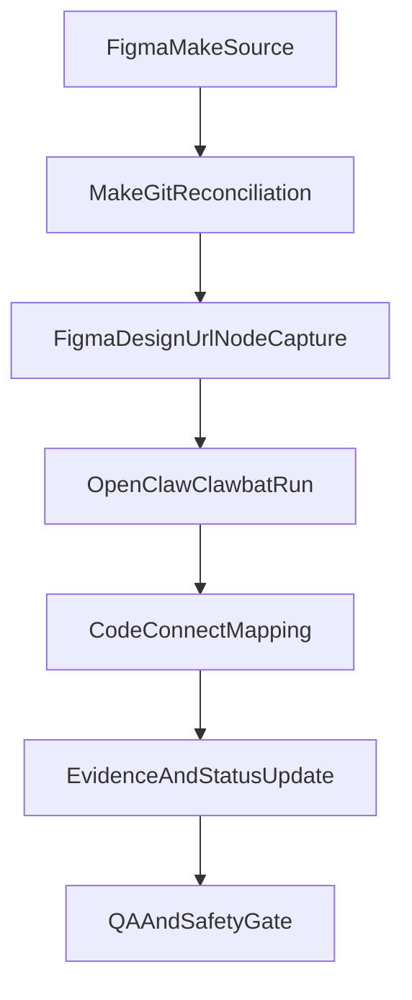

# Figma + Clawbot Operating Model (H+P+Pr)

Date: 2026-02-19
Scope: Home + Plate + Progress (`H+P+Pr`) for Web + iOS
Mode: process/systematization only (no runtime perimeter expansion)

## 1) Purpose

Define one canonical operating model for:
- `figma.com/make` ideation and reconciliation
- `figma.com/design` node-level mapping and Code Connect activation
- OpenClaw/Clawbat terminal execution with deterministic evidence

This file is the operational SoT for execution discipline. Domain behavior and
style constraints remain in existing SoT docs under `docs/figma/`, `docs/design/`,
and `docs/sora/`.

## 2) Source-of-Truth Lock

- `figma.com/make/...`:
  - Allowed: iteration, exploration, draft structure, drift audits
  - Forbidden: final node-level Code Connect activation claims
- `figma.com/design/...`:
  - Allowed: canonical layer selection, fileKey/nodeId capture, Code Connect activation
  - Required for: `get_code_connect_suggestions`, `get_code_connect_map`, final mapping evidence

If only Make is available, status must remain `blocked_by_design_url` in mapping docs.

## 3) Command Contract (OpenClaw/Clawbat)

Every terminal run must capture:
- exact command line
- working directory
- session id
- start/end timestamp
- exit code
- evidence snippet (1-3 raw lines) and pointer links

Forbidden:
- hidden skips (`|| true`, silent continue)
- manual paraphrase without raw evidence
- fabricated node ids or design keys

## 4) Session-ID Discipline

Session format:
- `figma-hpp-<YYYYMMDD>-<HHMMSS>`

Rules:
- One session id per run
- Same id across logs, evidence, and output docs
- No cross-session evidence reuse without explicit note

## 5) Artifact Capture Contract

Minimum artifact set per run:
- command block
- output block
- exit code
- affected docs/files
- blocker state (`none`, `blocked_by_design_url`, `blocked_by_node_id_capture`, `stale`)

Required fields in evidence summaries:
- `context_version` (date + commit)
- `fileKey` (if design-known)
- `nodeId` (if design-known)
- mapping status transition (`candidate -> validated -> active` when applicable)

## 6) Failure Triage Protocol

When run fails:
1. Copy first failing raw line(s)
2. Classify failure:
   - auth/token
   - missing design URL/node id
   - mapping mismatch
   - infra/transient (cache/network/service)
3. State impact:
   - no-op
   - partial update
   - rollback needed
4. Log next deterministic command for retry

Do not mark activation complete unless verification command succeeds.

## 7) Canonical Flow

## 8) Execution Checklist (per task)

- Read:
  - `docs/figma/FIGMA_IMPLEMENTATION_RUNBOOK.md`
  - `docs/figma/FIGMA_CODE_CONNECT_BRIDGE_HPP.md`
  - `docs/figma/FIGMA_DESIGN_URL_NODEID_CAPTURE_HPP.md`
- Run with session id and capture evidence
- Update mapping status and blocker state
- Run QA checklist:
  - `docs/sora/SORA_STYLE_QA_CHECKLIST.md`

## 9) Non-negotiable Safety Rules

- No secrets/internal URLs in prompts or evidence
- No medical claims or diagnosis framing
- No palette drift outside canonical tokens without explicit approved exception
- No replacing canonical route/auth behavior with design-only assumptions

## 10) Related Canonical Docs

- `docs/figma/FIGMA_IMPLEMENTATION_RUNBOOK.md`
- `docs/figma/FIGMA_CODE_CONNECT_BRIDGE_HPP.md`
- `docs/figma/FIGMA_DESIGN_URL_NODEID_CAPTURE_HPP.md`
- `docs/figma/FIGMA_CODE_CONNECT_MAPPING_CANDIDATES_HPP.md`
- `docs/sora/SORA_STYLE_QA_CHECKLIST.md`
