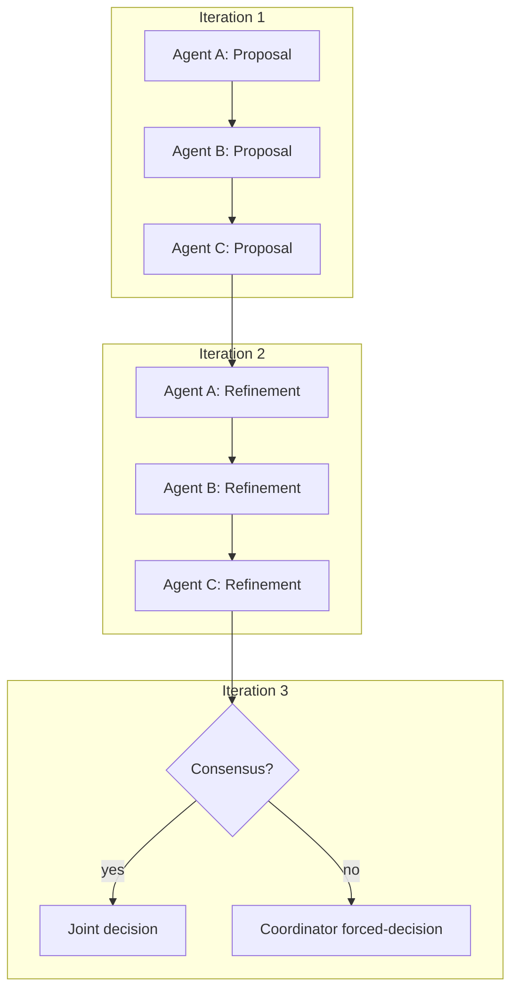
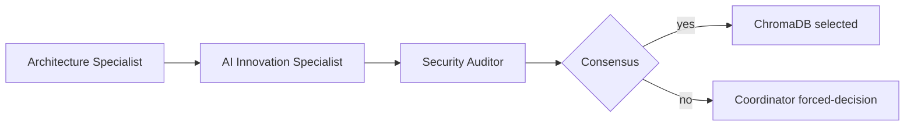

# Шаблон диалога агентов (Agent Dialogue Template)

<!-- markdownlint-disable MD013 MD022 MD024 MD032 -->

**Назначение:** Формальный протокол для брейншторма и принятия решений несколькими агентами.

**Status:** Canonical (PR-634). Канонический источник истины для лимита итераций диалога.

**Язык:** RU-first; английские термины — в скобках или `code` при первом упоминании.

---

## Overview

Когда у задачи есть **несколько валидных подходов**, агенты ведут структурный диалог, чтобы:
- изучить альтернативы,
- выявить компромиссы (trade-offs),
- прийти к консенсусу (или эскалировать в координатора).

**Критично:** диалог ограничен по времени и итерациям (≤3), чтобы не допускать бесконечных обсуждений.

---

## Когда использовать диалог (When to Use Dialogue)

Используйте диалог, когда:
- есть несколько валидных дизайн-подходов,
- компромиссы неочевидны,
- нужна экспертиза из разных доменов.

Не используйте диалог, когда:
- один подход очевиден,
- координатор уже принял решение,
- задача тривиальная.

---

## Жёсткий лимит диалога (Dialogue Hard Limit)

**Максимум итераций:** 3 всего (на весь диалог, для всех агентов)

**Путь эскалации:**
1. Итерации 1–2: брейншторм, альтернативы, trade-offs
2. Итерация 3: конвергенция (convergence) или явное перечисление блокеров
3. После итерации 3: координатор фиксирует итог (если консенсус есть) или принимает `forced-decision` и закрывает обсуждение

Без исключений: если консенсус не достигнут за 3 итерации, координатор:
- синтезирует лучший доступный вариант,
- документирует trade-offs и риски,
- продолжает с явным маркером `forced-decision`.

Rationale (обоснование): предотвратить бесконечные LLM-дискуссии и обеспечить завершение задачи.

---

## Правило вмешательства координатора (Coordinator Intervention Rule)

### Во время диалога (Iterations 1–3)

Координатор НЕ ДОЛЖЕН:
- предлагать решения,
- делать синтез (synthesis),
- принимать финальные решения,

пока не завершены **все Iterations 1–3** текущего диалога.

Единственное исключение:
- координатор может **уточнить ограничения (constraints)** или **критерии успеха (success criteria)**,
  НЕ предлагая решений и НЕ синтезируя выводы.

### После диалога (post-dialogue)

После завершения Iteration 3 диалог считается **закрытым**, и координатор **возвращается к обязанностям синтеза**:
- фиксирует исход (record) при наличии консенсуса,
- либо делает `forced-decision` при отсутствии консенсуса,
- затем выполняет финальную сборку решения на этапе финализации / sync point.

См. также:
- `.cursor/agents/agent-coordinator.md` → **Work Synthesis & Quality Assurance**
- `docs/orchestration/workflow.md` → шаг **Synthesis**
- `docs/orchestration/PARALLEL_WORK_PROTOCOL.md` → **Sync Point** (финализация треков)

---

## Формат диалога (Dialogue Format)

### Формулировка проблемы (Problem Statement)

[Что решаем? Что неясно?]

**Constraints (ограничения):**
- [Какие инварианты затрагиваем]
- [Какие quality gates применимы]
- [Дедлайны/таймбоксы]

**Success criteria (критерии успеха):**
- [Как выглядит “хорошее решение”?]

---

### Итерация 1: первичные предложения (Iteration 1: Initial Proposals)

#### Agent A (e.g., Architecture)

**Предложение (Proposal):**
- [Идея/подход]

**Плюсы (Pros):**
- [Что хорошо в этом подходе]

**Минусы/риски (Cons):**
- [Что рискованно или неясно]

**Затронутые инварианты (Invariants affected):**
- [Какие правила/инварианты затрагиваем]

**Вопросы к Agent B:**
- [Конкретный вопрос по домену B]

---

#### Agent B (e.g., Bug Hunter)

**Ответ Agent A:**
- [Ответ на вопрос A]

**Предложение (Proposal):**
- [Альтернатива или уточнение подхода A]

**Плюсы (Pros):**
- [Что хорошо]

**Минусы/риски (Cons):**
- [Что рискованно]

**Testing strategy (как проверяем):**
- [Как верифицируем подход]

**Вопросы к Agent C (если 3+ агентов):**
- [Конкретный вопрос по домену C]

---

### Итерация 2: уточнение (Iteration 2: Refinement)

#### Agent A (refined)

**Ответ на замечания Agent B:**
- [Как учитываем/снимаем concerns]

**Обновлённое предложение:**
- [Уточнённый подход с учётом фидбэка]

**Принятые trade-offs:**
- [Чем готовы пожертвовать]

**Оставшиеся вопросы:**
- [Неразрешённые блокеры]

---

#### Agent B (refined)

**Ответ на обновление Agent A:**
- [Реакция на обновление]

**Проверка конвергенции (Convergence check):**
- ✅ Консенсус достигнут: [описать]
- ⏳ Всё ещё обсуждаем: [что блокирует]
- ❌ Несогласие: [фундаментальный конфликт]

---

### Итерация 3: финал (Iteration 3: Final Decision or Escalation)

Если консенсус достигнут:

#### Agent A + Agent B (joint)

**Финальный подход:**
- [Совместное решение]

**Обоснование (Rationale):**
- [Почему выбран именно этот вариант]

**Trade-offs:**
- [Что принимаем]

**План имплементации:**
- [Следующие шаги]

---

Если консенсус не достигнут:

#### Coordinator (forced-decision)

**Причина эскалации (Escalation reason):**
- [Почему агенты не смогли прийти к консенсусу]

**Финальное решение (Final decision):**
- [Выбор координатора]

**Обоснование (Rationale):**
- [Почему выбран этот вариант, несмотря на разногласия]

**Принятые риски (Risks accepted):**
- [Известные trade-offs]

**Follow-up:**
- [План пересмотра, если решение окажется неверным]

**Маркер принудительного решения (`forced-decision`):** ⚠️ override координатора (iteration 3 limit)

---

## Мульти-диалог (3+ агентов) (Multi-Agent Dialogue)

Когда участвуют 3+ агентов:

Структура:
1. Раунд 1: каждый агент предлагает (parallel)
2. Раунд 2: ответы друг другу (sequential)
3. Раунд 3: конвергенция или эскалация

**Критично:** всё равно ≤3 итераций всего (не “3 на каждого агента”).

---

## Пример: диалог по RAG (Example: RAG Implementation Dialogue)

### Формулировка проблемы

Используем векторную БД (Pinecone) или локальные эмбеддинги (ChromaDB) для RAG?

**Ограничения (Constraints):**
- Должно работать offline (опционально)
- Бюджет: минимальные расходы
- Латентность: <500ms

**Критерии успеха (Success criteria):**
- Качество retrieval (≥80% релевантности)
- Поддерживаемость (no vendor lock-in)

---

### Итерация 1

#### Architecture Specialist

**Предложение (Proposal):** ChromaDB (локальные эмбеддинги)

**Плюсы (Pros):**
- Нет расходов на API
- Работает offline
- Нет vendor lock-in

**Минусы (Cons):**
- Медленнее Pinecone
- Нужна поддержка embedding-модели

**Вопросы к AI Innovation:**
- Сможем ли уложиться в <500ms на ChromaDB?

---

#### AI Innovation Specialist

**Ответ Architecture:**
- ChromaDB укладывается в <500ms при кэшировании эмбеддингов (проверено)

**Предложение (Proposal):** Hybrid approach — ChromaDB for dev, Pinecone for prod

**Плюсы (Pros):**
- Best of both worlds
- Независимость dev
- Производительность в prod

**Минусы (Cons):**
- Сложность dual config
- Нужно тестировать оба пути

**Вопросы к Security:**
- Есть ли риски data residency при Pinecone?

---

#### Security Auditor

**Ответ AI Innovation:**
- Pinecone имеет EU/US дата-центры (приемлемо)
- Но: риск управления API ключами

**Предложение (Proposal):** Только ChromaDB (без внешней зависимости)

**Плюсы (Pros):**
- Меньше риск data exfiltration
- Проще security model

**Минусы (Cons):**
- Компромисс по производительности

---

### Итерация 2

#### Architecture Specialist
- Уточняет архитектурные trade-offs и подтверждает, что ChromaDB не нарушает layer boundaries (границы слоёв)

#### AI Innovation Specialist
- Предоставляет benchmark: ChromaDB + LRU cache ≈ 350ms
- Подтверждает достижение latency < 500ms

#### Security Auditor
- Подтверждает, что локальное решение снижает attack surface
- Отмечает отсутствие vendor lock-in как плюс

---

### Iteration 3 (Agents convergence)

#### Architecture Specialist + AI Innovation Specialist + Security Auditor (consensus)

**Final approach:** ChromaDB (local embeddings)

**Rationale:**
- Meets latency requirement (350ms < 500ms)
- No API costs
- No vendor lock-in
- Simpler security model

**Trade-offs accepted:**
- Slightly slower than Pinecone (acceptable)
- Need to manage embedding model (acceptable)

**Implementation plan:**
1. Install ChromaDB
2. Implement embedding cache
3. Benchmark with real data
4. Document rollback to Pinecone if latency degrades

**Marker:** ✅ Consensus reached

---

### After Iteration 3: Coordinator Record (no new decisions)

#### Coordinator (record only)

**Outcome recorded:**
- Consensus reached in Iteration 3
- Final approach: ChromaDB (local embeddings)

**Notes:**
- No forced-decision needed
- Any follow-ups should be recorded in `BACKLOG_LEDGER.md` if deferred

---

## Визуализация диалога (Dialogue Visualization Contract)

**Назначение:** единый формат Mermaid-графа для аудита multi-agent диалогов.

### Формат входа (Input Contract)

- `dialogue_id`: стабильный идентификатор сессии (например, `dlg-2026-02-18-001`)
- `task_id`: идентификатор задачи/PR (например, `PR-795`)
- `participants`: список агентов с ролями
- `iterations`: ровно 1-3 итерации
- `edges`: сообщения/ответы между агентами с направлением
- `outcome`: `consensus` или `forced-decision`

### Формат выхода (Mermaid Output Contract)

### Обязательные поля на рёбрах (Edge Metadata)

- `from_agent`
- `to_agent`
- `iteration`
- `message_type` (`proposal`, `question`, `refinement`, `decision`)

### Пример (Example Snapshot)

Правило соответствия:
- если в диалоге зафиксирован `forced-decision`, в графе обязательно должна быть ветка `no -> Coordinator forced-decision`.

---

## Проверочный чек-лист (Verification Checklist)

Перед началом диалога проверьте:
- [ ] проблема сформулирована
- [ ] есть несколько валидных подходов
- [ ] trade-offs неочевидны
- [ ] определены релевантные агенты

Если что-то неясно, уточните до старта.

---

## Связанные документы (Related Documentation)

- Handoff Protocol: `docs/orchestration/AGENT_HANDOFF_PROTOCOL.md`
- Parallel Work: `docs/orchestration/PARALLEL_WORK_PROTOCOL.md`
- Coordinator: `.cursor/agents/agent-coordinator.md`

---

**Last updated:** 2026-02-03 (PR-634)
**Status:** Canonical
