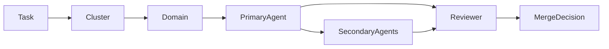

# Agent Routing Graph (SoT)

**Purpose:** Canonical routing SoT for coordinator. Normalizes task → domains → agents.

**Status:** Canonical (coordinator MUST use this for deterministic routing)

---

## 1. Purpose

- Canonical routing SoT for the orchestration layer
- Used by coordinator for task → domain → agent assignment
- Normalizes task type → domains → agents

---

## 2. Task → Domains

| Task Type      | Domains  |
|----------------|----------|
| Backend API    | backend  |
| iOS UI         | ios      |
| Web UI         | frontend |
| Infrastructure | infra    |
| Security       | security |
| AI / ML        | ml       |
| Computer Vision | cv      |
| Design         | design   |
| Documentation  | docs     |
| Research       | research |
| Creative Research | research |
| Safety / Philosophy / Logic | safety  |
| QA             | qa       |
| Release        | release  |
| Wellness       | wellness |
| Business       | business |
| Orchestration  | orchestration |

---

## 3. Cluster Definitions

| Cluster  | Purpose |
|----------|---------|
| backend  | Core backend implementation and architecture routing for API and domain logic work. |
| platform | User-surface delivery routing for web, iOS, and design execution tracks. |
| ops      | Orchestration, documentation, QA, security, and infrastructure coordination routing. |
| ml       | AI, research, and model-systems routing for experimental and production ML seams. |
| safety   | Safety-language, logic, and claim-boundary routing for wellness-safe output review. |
| growth   | Release, wellness, and business routing for distribution and monetization work. |

Enforcement evidence: `scripts/orchestration/routing_graph_loader.py:121-169`, `scripts/orchestration/routing_graph_loader.py:181-316`, `tests/guards/test_agent_consistency_guard.py:64-85`.

---

## 4. Domains → Agents

| Domain   | Cluster  | Primary Agent            | Secondary                       | Reviewer                |
|----------|----------|--------------------------|---------------------------------|-------------------------|
| backend  | backend  | backend-engineer         | architecture-specialist         | security-auditor        |
| ios      | platform | frontend-engineer        | creative-designer               | qa-engineer-agent       |
| frontend | platform | frontend-engineer        | creative-designer               | qa-engineer-agent       |
| infra    | ops      | dev-operator             | architecture-specialist         | security-auditor        |
| security | ops      | security-auditor         | architecture-specialist         | agent-coordinator       |
| ml       | ml       | ai-innovation-specialist | rag-systems-agent               | architecture-specialist |
| cv       | ml       | cv-agent                 | data-scientist-agent            | security-auditor        |
| docs     | ops      | cursor-specialist-agent  | web-research-agent              | qa-engineer-agent       |
| design   | platform | creative-designer        | frontend-engineer               | qa-engineer-agent       |
| research | ml       | web-research-agent       | ai-innovation-specialist        | agent-coordinator       |
| safety   | safety   | philosophy-agent         | logic-agent                     | agent-coordinator       |
| qa       | ops      | qa-engineer-agent        | bug-hunter                      | agent-coordinator       |
| release  | growth   | app-store-release-agent  | marketing-strategist            | qa-engineer-agent       |
| wellness | growth   | wellness-analyst-agent   | marketing-strategist            | business-strategist-agent |
| business | growth   | business-strategist-agent | marketing-strategist           | agent-coordinator       |
| orchestration | ops | agent-coordinator        | cursor-specialist-agent         | architecture-specialist |

---

## 5. Bootstrap Lane Activation

| Lane     | Signal | Decision Mode |
|----------|--------|---------------|
| judgment | judgment | verification_first |
| judgment | adjudication | verification_first |
| judgment | evidence reconciliation | verification_first |
| judgment | evidence_reconciliation | verification_first |
| judgment | verification-first | verification_first |
| judgment | verification_first | verification_first |
| judgment | creative research | verification_first |
| judgment | creative_research | verification_first |
| judgment | fitchef | verification_first |
| judgment | fit_chef | verification_first |
| judgment | docs/orchestration/JUDGMENT_ADJUDICATION_SUBLANE_PROTOCOL.md | verification_first |
| judgment | docs/orchestration/EVIDENCE_RECONCILIATION_PROTOCOL.md | verification_first |
| judgment | core/judgment.py | verification_first |

Bootstrap evidence: `scripts/orchestration/routing_graph_loader.py`, `scripts/orchestration/task_bootstrap.py`, `tests/test_routing_graph_loader.py`, `tests/test_task_bootstrap.py`.

---

## 6. Routing Rules

1. Coordinator selects exactly 1 primary agent.
2. Canonical routing graph allows exactly 0..1 secondary agent in the `Secondary` column; do not encode comma-separated secondaries here. Additional collaborators stay advisory in task analysis or capability guidance.
3. Runtime changes require reviewer.
4. Docs-only tasks may omit reviewer.
5. Coordinator retains final authority.
6. **Domain `safety`** = wellness language boundaries + claim semantics + contradiction checks (single definition; do not duplicate elsewhere).
7. **Reviewer** in this graph = process/merge reviewer, not formal security review (formal review semantics live in `AGENT_CAPABILITY_MATRIX.md`).
8. **Mixed-scope or novel tasks:** Coordinator selects primary domain by dominant scope; ties broken by coordinator; novel tasks escalate to `agent-coordinator` for adjudication.
9. **Independent reviewer invariant:** reviewer must never equal the selected primary agent after telemetry/advisory overrides.
10. **Cluster-first routing:** coordinator resolves `cluster` first for metrics and packaging, then selects domain-level primary/secondary/reviewer.
11. **Skills after routing:** once primary domain is resolved, coordinator selects `recommended_skills` via `docs/orchestration/AGENT_SKILL_ROUTING_POLICY.md` and task bootstrap artifacts.
12. **`creative_research` sub-lane:** route through `research` first, then apply phase-specific role mapping from `docs/orchestration/CREATIVE_RESEARCH_SUBLANE_PROTOCOL.md`. The sub-lane refines execution inside the experimentation umbrella; it does not replace this routing graph.
13. **CV routing invariant:** generic coordinator/task packets route CV-first work through `domain=cv`, `cluster=ml`. Governed experimentation packets may remain `ml`-scoped until their contract is migrated explicitly.
14. **Explicit requested-agent override:** after canonical domain routing resolves, bootstrap may promote a user-requested agent when it already belongs to the routed domain slot set (primary / secondary / reviewer). If the request targets a non-routable specialist, coordinator must keep it as an advisory collaborator unless a separate contract explicitly promotes it.
15. **Privileged-surface review rule:** tasks touching `.github/workflows/**`, `ios/fastlane/**`, `scripts/orchestration/**`, or merge-governance scripts/docs must include `security-auditor` in the review path, even when the dominant domain is docs/orchestration/release rather than security.
16. **Docs vs research split:** internal policy/runbook/docs maintenance defaults to `docs` -> `cursor-specialist-agent`; external web/OSS intake remains `research` -> `web-research-agent`.

Audit evidence: `scripts/orchestration/check_agent_consistency.py:103-209`, `tests/test_routing_graph_loader.py:159-315`, `tests/guards/test_agent_consistency_guard.py:179-216`.

---

## 7. Mermaid Routing Graph

---

## 8. Related Documentation

- Capability Matrix: `docs/orchestration/AGENT_CAPABILITY_MATRIX.md`
- Skill Routing Policy: `docs/orchestration/AGENT_SKILL_ROUTING_POLICY.md`
- Context Map: `docs/orchestration/AGENT_CONTEXT_MAP.md`
- Coordinator: `.cursor/agents/agent-coordinator.md`

---

**Last updated:** 2026-03-20 (bootstrap-lane activation canonicalization)
