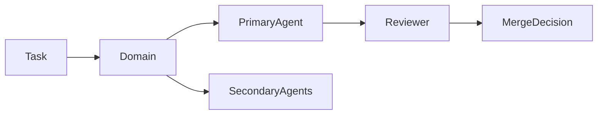

# Agent Routing Graph (SoT)

**Purpose:** Canonical routing SoT for coordinator. Normalizes task → domains → agents.

**Status:** Canonical (coordinator MUST use this for deterministic routing)

---

## 1. Purpose

- Canonical routing SoT for the orchestration layer
- Used by coordinator for task → domain → agent assignment
- Normalizes task type → domains → agents

---

## 2. Task → Domains

| Task Type      | Domains  |
|----------------|----------|
| Backend API    | backend  |
| iOS UI         | ios      |
| Web UI         | frontend |
| Infrastructure | infra    |
| Security       | security |
| AI / ML        | ml       |
| Design         | design   |
| Documentation  | docs     |
| Research       | research |
| Safety / Philosophy / Logic | safety  |

---

## 3. Domains → Agents

| Domain   | Primary Agent            | Secondary                | Reviewer                |
|----------|--------------------------|--------------------------|-------------------------|
| backend  | architecture-specialist  | backend-engineer, bug-hunter | security-auditor        |
| ios      | frontend-engineer        | creative-designer        | bug-hunter              |
| frontend | frontend-engineer        | creative-designer        | bug-hunter              |
| infra    | dev-operator             | architecture-specialist | security-auditor        |
| security | security-auditor         | architecture-specialist  | agent-coordinator       |
| ml       | ai-innovation-specialist| web-research-agent       | architecture-specialist |
| docs     | web-research-agent       | agent-coordinator        | bug-hunter              |
| design   | creative-designer        | frontend-engineer        | agent-coordinator       |
| research | web-research-agent       | ai-innovation-specialist| agent-coordinator       |
| safety   | philosophy-agent         | logic-agent             | agent-coordinator       |

---

## 4. Routing Rules

1. Coordinator selects exactly 1 primary agent.
2. Maximum 2 secondary agents allowed.
3. Runtime changes require reviewer.
4. Docs-only tasks may omit reviewer.
5. Coordinator retains final authority.
6. **Domain `safety`** = wellness language boundaries + claim semantics + contradiction checks (single definition; do not duplicate elsewhere).
7. **Reviewer** in this graph = process/merge reviewer, not formal security review (formal review semantics live in `AGENT_CAPABILITY_MATRIX.md`).
8. **Mixed-scope or novel tasks:** Coordinator selects primary domain by dominant scope; ties broken by coordinator; novel tasks default to primary domain of most relevant agent per capability matrix.

---

## 5. Mermaid Routing Graph

---

## Related Documentation

- Capability Matrix: `docs/orchestration/AGENT_CAPABILITY_MATRIX.md`
- Context Map: `docs/orchestration/AGENT_CONTEXT_MAP.md`
- Coordinator: `.cursor/agents/agent-coordinator.md`

---

**Last updated:** 2026-03-04 (PR #967)
