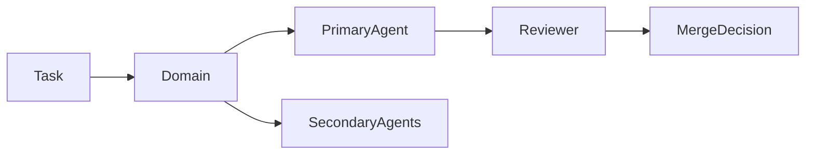

# Agent Routing Graph (SoT)

**Purpose:** Canonical routing SoT for coordinator. Normalizes task → domains → agents.

**Status:** Canonical (coordinator MUST use this for deterministic routing)

---

## 1. Purpose

- Canonical routing SoT for the orchestration layer
- Used by coordinator for task → domain → agent assignment
- Normalizes task type → domains → agents

---

## 2. Task → Domains

| Task Type      | Domains  |
|----------------|----------|
| Backend API    | backend  |
| iOS UI         | ios      |
| Web UI         | frontend |
| Infrastructure | infra    |
| Security       | security |
| AI / ML        | ml       |
| Design         | design   |
| Documentation  | docs     |
| Research       | research |
| Safety / Philosophy / Logic | safety  |
| QA             | qa       |
| Release        | release  |
| Wellness       | wellness |
| Business       | business |
| Orchestration  | orchestration |

---

## 3. Domains → Agents

| Domain   | Cluster  | Primary Agent            | Secondary                       | Reviewer                |
|----------|----------|--------------------------|---------------------------------|-------------------------|
| backend  | backend  | architecture-specialist  | backend-engineer, bug-hunter    | security-auditor        |
| ios      | platform | frontend-engineer        | creative-designer               | qa-engineer-agent       |
| frontend | platform | frontend-engineer        | creative-designer               | qa-engineer-agent       |
| infra    | ops      | dev-operator             | architecture-specialist         | security-auditor        |
| security | ops      | security-auditor         | architecture-specialist         | agent-coordinator       |
| ml       | ml       | ai-innovation-specialist | rag-systems-agent               | architecture-specialist |
| docs     | ops      | web-research-agent       | cursor-specialist-agent         | qa-engineer-agent       |
| design   | platform | creative-designer        | frontend-engineer               | qa-engineer-agent       |
| research | ml       | web-research-agent       | ai-innovation-specialist        | agent-coordinator       |
| safety   | safety   | philosophy-agent         | logic-agent                     | agent-coordinator       |
| qa       | ops      | qa-engineer-agent        | bug-hunter                      | agent-coordinator       |
| release  | growth   | app-store-release-agent  | marketing-strategist            | qa-engineer-agent       |
| wellness | growth   | wellness-analyst-agent   | marketing-strategist            | business-strategist-agent |
| business | growth   | business-strategist-agent | marketing-strategist           | agent-coordinator       |
| orchestration | ops | cursor-specialist-agent  | dev-operator                    | architecture-specialist |

---

## 4. Routing Rules

1. Coordinator selects exactly 1 primary agent.
2. Maximum 2 secondary agents allowed.
3. Runtime changes require reviewer.
4. Docs-only tasks may omit reviewer.
5. Coordinator retains final authority.
6. **Domain `safety`** = wellness language boundaries + claim semantics + contradiction checks (single definition; do not duplicate elsewhere).
7. **Reviewer** in this graph = process/merge reviewer, not formal security review (formal review semantics live in `AGENT_CAPABILITY_MATRIX.md`).
8. **Mixed-scope or novel tasks:** Coordinator selects primary domain by dominant scope; ties broken by coordinator; novel tasks default to primary domain of most relevant agent per capability matrix.
9. **Independent reviewer invariant:** reviewer must never equal the selected primary agent after telemetry/advisory overrides.
10. **Cluster-first routing:** coordinator resolves `cluster` first for metrics and packaging, then selects domain-level primary/secondary/reviewer.
11. **Skills after routing:** once primary domain is resolved, coordinator selects `recommended_skills` via `docs/orchestration/AGENT_SKILL_ROUTING_POLICY.md` and task bootstrap artifacts.

---

## 5. Mermaid Routing Graph

---

## Related Documentation

- Capability Matrix: `docs/orchestration/AGENT_CAPABILITY_MATRIX.md`
- Skill Routing Policy: `docs/orchestration/AGENT_SKILL_ROUTING_POLICY.md`
- Context Map: `docs/orchestration/AGENT_CONTEXT_MAP.md`
- Coordinator: `.cursor/agents/agent-coordinator.md`

---

**Last updated:** 2026-03-07 (PR #996)
